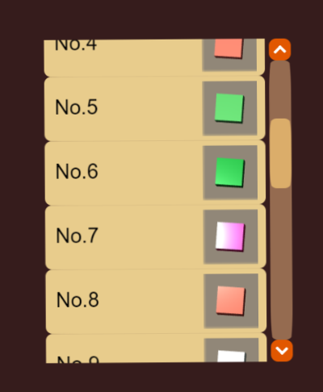

# Laya混合图层


## 支持
- laya-ui
- fgui

## 特点
- 使用2d相对坐标操作3d容器,保持和2d对象一致
- 无需考虑容器缩放,只需在初始化时传入`对齐容器`即可
- 轻松开启滚动跟随
- 多混合层支持,轻松应对Tab页快速切换

## 演示

[点击跳转](https://kevinchen2046.github.io/demo/laya-d3view)



## 用法

```typescript
//获取混合视图
let view=D3View.get("ui");
//获取混合层
let layer=view.getLayer("panel1");
//初始化layer
layer.initialize({
    //对齐到的控件 可以是Laya.List,fgui.GList,fgui.GComponent,Laya.Sprite的一种
    //但跟随的滚动的效果会有差异
    aglinComp: this.list,
    //开启y方向滚动
    scroll: { y: true }
});

//创建D3容器
let sprite3d=new D3Sprite();
//添加到混合层
view.addToLayer("panel1", sprite3d);
sprite3d.pos(x,y);//这里的坐标是相对于view的2d坐标

//2d容器操作
let sprite=new Sprite();
view.addToLayerTop("panel1", sprite);
sprite.pos(x,y);//这里的坐标是相对于view的2d坐标

//开启混合层
view.enableLayer("panel1");
//刷新视口
view.update();
//关闭混合层
view.disableLayer("panel1");
//关闭全部混合层
view.disableLayer();
```